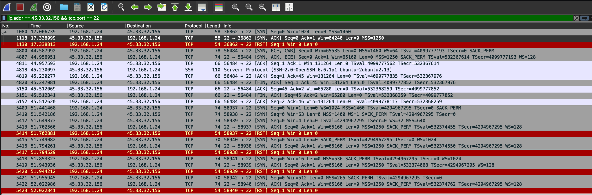

# Nmap & Wireshark Network Analysis

## Overview
This project demonstrates basic network reconnaissance and packet analysis using Nmap and Wireshark.

## Objectives
- Perform port scanning using Nmap
- Detect running services
- Capture network packets
- Analyze TCP communication
- Understand protocol hierarchy

## Tools Used
- Nmap 7.99
- Wireshark
- macOS

## Project Structure

Phase 1/
- nmap_scan_output.png
- phase1_notes.txt

Phase 2/
- service_detection.png
- phase2_notes.txt

Phase 3/
- scan_capture.pcapng
- conversations.png
- protocol_hierarchy.png
- open_port22.png
- syn_packet.png
- syn_ack.png
- closed_port8022.png

Report/
- Network_Scanning_Report.docx

## Skills Demonstrated
- Network Scanning
- Service Enumeration
- TCP/IP Analysis
- Packet Inspection
- Wireshark Traffic Analysis
- Cybersecurity Fundamentals

## Author
Saiyam Goyal
